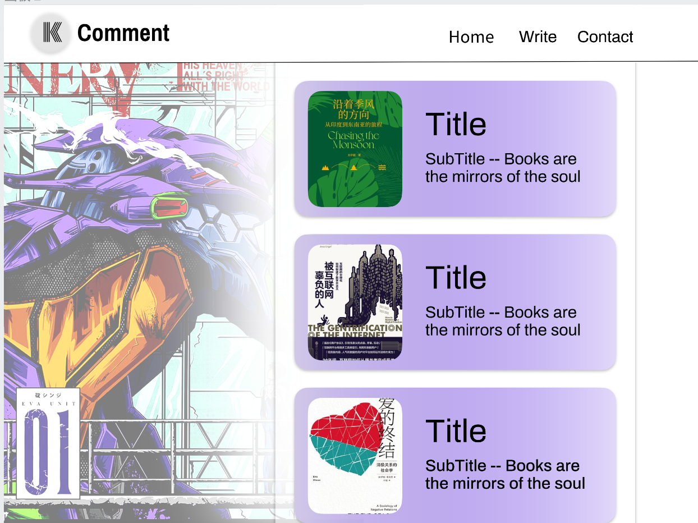

# 个人影评书评站点

## 项目简介

- 定位： 博客
- 内容： 影评，书评

通过分享记录对各类影视作品以及书籍的观点看法，促成自己的思考，以及，可能的话，引起他人的共鸣。

## 对标的网站

- 总览页面 -- [豆瓣](https://m.douban.com/movie/)
- 文章页面 -- [Medium](https://medium.com/)

## 内容来源以及素材

- 封面，背景图片 -- 伟大的互联网
- 文字内容 -- 自己撰写

## 媒体类型说明

文本和图片

## 内容字段说明

- 封面图片
- 背景图片
- 文章标题
- 副标题/简短的描述
- 文章标签（书籍/电影， 主题类型--科幻、动作、战争...）
- 文章内容

## 基本界面

### 主页/HomePage

### 文章总览页面/ViewPage

### 文章页面/ArticlePage

### 表单页面/PostPage

## 项目预览
[--> Working on... <--](https://kiameow.github.io/hdu_web_final_lab/final_lab)

